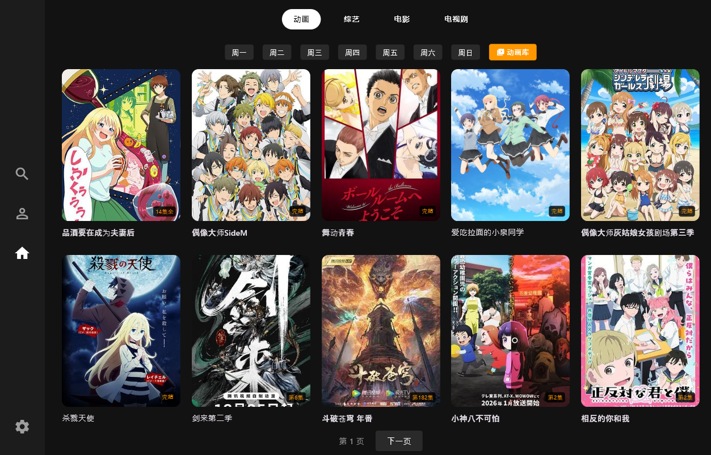

# ZycFun TV - Android TV/投影仪第三方客户端 (Flutter)

[](https://flutter.dev)
[](https://www.android.com/tv/)
[](LICENSE)

这是一个基于 Flutter 开发的 **Omofun** 动漫网站第三方客户端，专为 **Android TV** 和 **投影仪** 等大屏设备设计。项目完全适配遥控器操作，拥有流畅的焦点动画、内置Web服务器控制台以及完善的播放体验。



## ✨ 主要功能

*   **📺 TV 专属交互**：全套 UI 适配遥控器焦点移动（D-Pad Navigation），操作逻辑符合大屏习惯。


*   **🎞️ 沉浸式播放器**：
    *   支持全屏/窗口模式切换。
    *   支持遥控器左右键快进/快退（带防抖优化）。
    *   实时显示缓冲速度（网速监测）。
    *   自动记录播放进度，下次进入自动跳转（断点续播）。

*   **📡 内置 Web 控制台**：
    *   手机/电脑浏览器访问 TV IP 即可控制。
    *   远程投送播放地址。
    *   远程管理收藏夹内容。
    *   远程查看运行日志（方便在 TV 无调试环境时排错）。
    *   远程切换线路。
*   **📂 内容管理**：
    *   周更表、分类库（动画/电影/电视剧/综艺）。
    *   搜索功能（支持 ID 直达和关键字搜索）。
    *   本地收藏夹与播放历史记录。


---
## 🚀 快速开始

### 开发环境
*   Flutter SDK: >=3.0.0
*   Android Studio / VS Code

### 运行步骤
1.  克隆仓库：
    ```bash
    git clone https://github.com/1522416243/ZycFun.git
    ```

2.  安装依赖：
    ```bash
    flutter pub get
    ```

3.  连接 Android TV 或 模拟器进行调试：
    ```bash
    flutter run
    ```
   
## 🙋‍♂️ 开发者说明
本人并不了解Flutter框架，该项目大部分代码由ai生成。项目仍有很多可优化的空间<del>(重构吧)</del>，欢迎各位开发者提 Issue/PR 一起完善，感谢支持！


 ## 免责声明
 ### 本项目仅供学习 Flutter 开发及 Android TV 应用架构研究使用。

*   所有视频资源均来自互联网，本项目不存储任何视频文件。
*   请勿将本项目用于任何商业用途。
*   如果源网站要求停止相关服务，本项目将配合整改或删除。